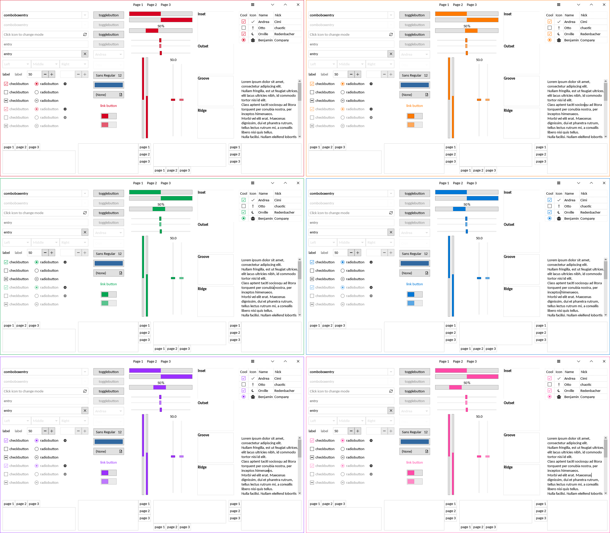
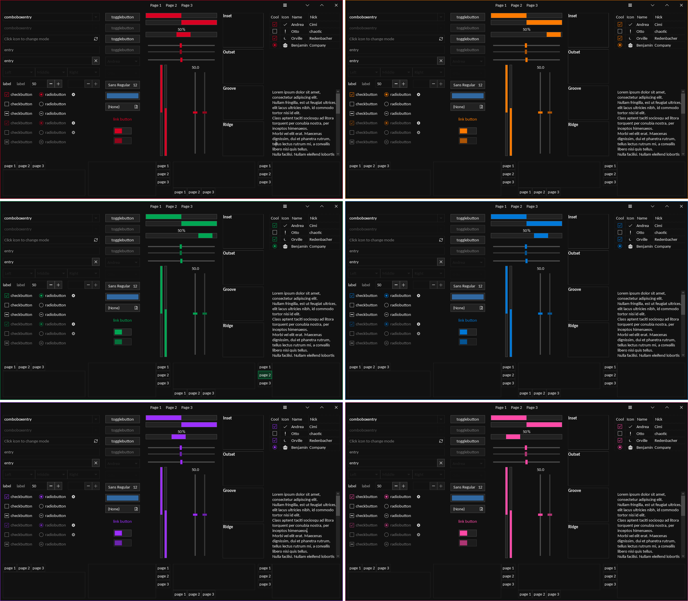

    
    <h2>Sheet GTK Theme</h2>

Sheet is a flat and sleek GTK theme that resembles Windows 10's win32 style, but more consistent and having support for accent colors and dark mode. Sheet looks best paired with KDE's Breeze icon theme as shown in the demo images.

Sheet is made for and used by the [Staklan](https://staklan.org/) project. You can find the mirror of it on [Codeberg](https://codeberg.org/romtelekom/staklan-theme).

### Light Mode

### Dark Mode

